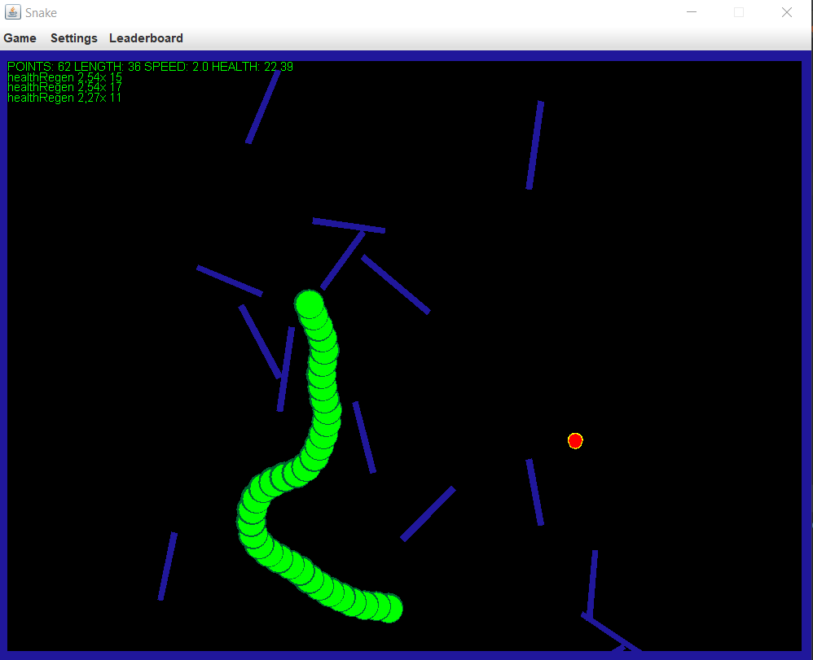

# Snake

Java-ban írt játék, Swing GUI-val.

Snake játék, ahol a kígyó nem négyzetrácson mozog, hanem folytonos 2D térben. A kígyó bármekkora szögben el tud fordulni. A játék során almákat vesz fel a kígyó, amelyek pontot érnek. Emellett aranyalmák is találhatóak a pályán, amelyek különböző effektekkel láthatják el a kígyót (pl.: egy alma jobban növeli a hosszt) A kígyó útját akadályok állják, amelyek a játék során kerülnek a pályára és sebzést okoznak.
 
